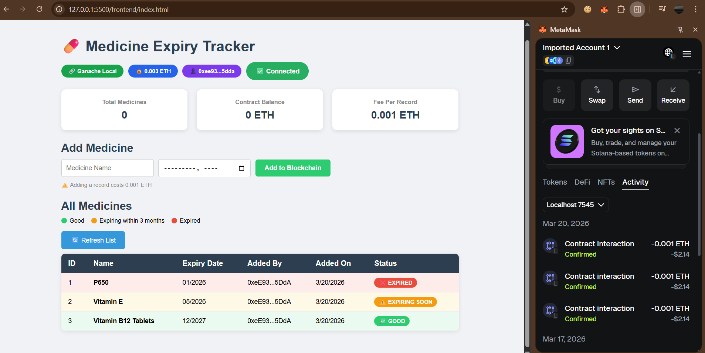

# 💊 Medicine Expiry Tracker DApp

A Blockchain-based Medicine Expiry Tracking System built using Ethereum, Solidity, Web3.js, MetaMask, and Truffle. This decentralized application (DApp) allows users to securely store medicine records with expiry dates on the Ethereum blockchain — ensuring transparency, immutability, and tamper-proof medical data storage.

## 🚀 Project Overview

Traditional medicine tracking systems rely on centralized databases that can be modified or tampered with. This DApp stores medicine records directly on the Ethereum blockchain, making the data:

- ✅ Secure
- ✅ Immutable
- ✅ Transparent
- ✅ Decentralized

Users can:
- Connect their MetaMask wallet
- Add medicine records (costs 0.001 ETH per entry)
- View all medicines with real-time expiry status
- Track contract balance
- Instantly identify Expired ❌, Expiring Soon ⚠️, and Good ✅ medicines

## 🛠️ Technologies Used

- **Solidity** — Smart contract development
- **Truffle** — Ethereum development framework
- **Ganache** — Local blockchain for testing
- **Web3.js** — Blockchain interaction
- **MetaMask** — Wallet integration
- **HTML, CSS, JavaScript** — Frontend

## 📂 Project Structure
```
medicine-tracker/
├── contracts/
│   └── MedicineTracker.sol
├── migrations/
│   └── 2_deploy_medicine.js
├── frontend/
│   ├── index.html
│   └── app.js
├── screenshots/
└── truffle-config.js
```

## ⚙️ Installation & Setup

**1️⃣ Clone the Repository**
```bash
git clone https://github.com/m21ahima/medicine-expiry-tracker.git
cd medicine-expiry-tracker
```

**2️⃣ Start Ganache**

Open Ganache and open the `medicine-tracker` workspace. Ensure it runs on:
```
HTTP://127.0.0.1:7545
```

**3️⃣ Deploy Smart Contract**
```bash
truffle migrate --reset
```
Copy the contract address from terminal output and paste it in `frontend/app.js`:
```javascript
const contractAddress = "YOUR_CONTRACT_ADDRESS_HERE";
```

**4️⃣ Connect MetaMask**
- Add Ganache network (RPC: `http://127.0.0.1:7545`, Chain ID: `1337`)
- Import a Ganache account using its private key

**5️⃣ Run the Application**

Right click `frontend/index.html` → Open with Live Server

Make sure MetaMask is connected to Localhost 7545

## 🔐 How It Works

1. User connects MetaMask wallet
2. User enters medicine name and expiry date
3. Frontend sends transaction using Web3.js with 0.001 ETH fee
4. Smart contract stores data permanently on Ethereum blockchain
5. All medicines are displayed with color-coded expiry status
6. Each addition creates a new immutable block on the blockchain

## 📸 Screenshots




## 🌍 Future Enhancements

- Role-based access (Pharmacist/Admin only record creation)
- Email/SMS alerts for medicines expiring soon
- IPFS integration for medicine images and documents
- React.js frontend
- Deployment on Sepolia Testnet
- Search and filter medicines by name or status

## 📜 License

This project is licensed under the MIT License.

## 👩‍💻 Author

Mahima
```

git add .
git commit -m "Improved README"
git push
